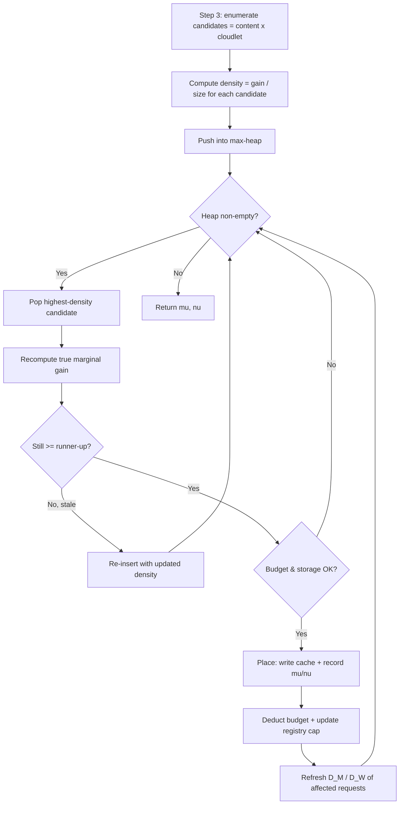
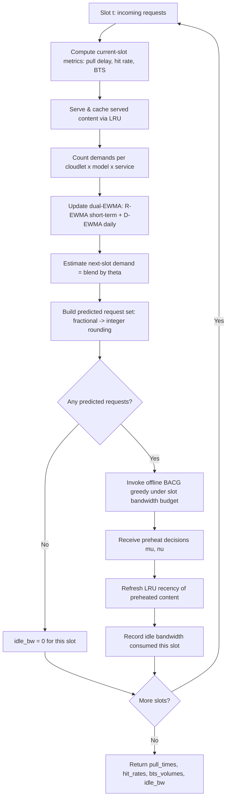

# bandwidth-aware-llm-serving

## Offline Algorithm: BACG (Bandwidth-Aware Co-caching Greedy)

`offline/bacg.py` It greedily preheats foundation
models and adapters by repeatedly placing the candidate with the highest
marginal-gain density (delay saved per GB), exploiting submodularity and lazy
evaluation for efficiency.

## Online Algorithm: DEWMA (Dual-EWMA continuous preheating)

`online/dewma.py` continuously preheats foundation models and adapters slot by
slot. For each time slot it serves the current requests, updates a dual-EWMA
demand estimator (a short-term R-EWMA blended with a daily-periodic D-EWMA),
predicts the next slot's demand, and invokes the offline BACG greedy under the
current slot's idle-bandwidth budget to decide what to preheat.

