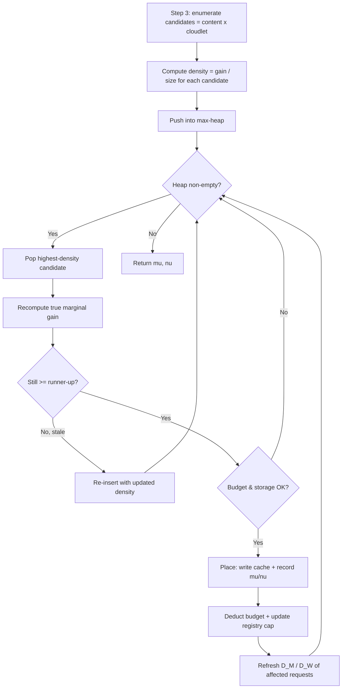

# bandwidth-aware-llm-serving

## Offline Algorithm: BACG (Bandwidth-Aware Co-caching Greedy)

`offline/bacg.py` It greedily preheats foundation
models and adapters by repeatedly placing the candidate with the highest
marginal-gain density (delay saved per GB), exploiting submodularity and lazy
evaluation for efficiency.

